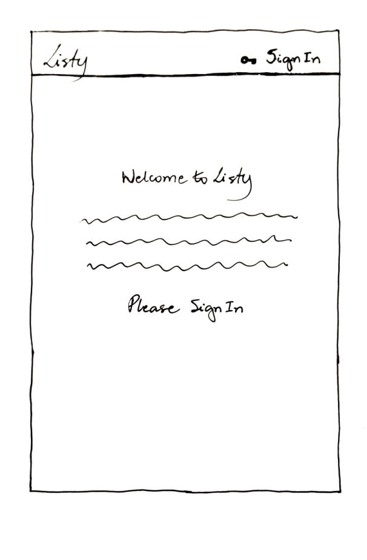
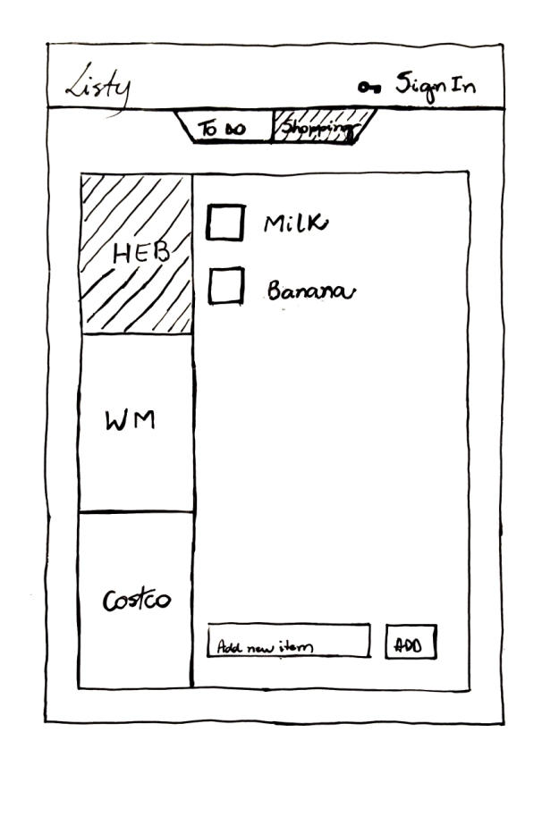

# Listy

Listy is a simple app that makes it easier to plan, organize and manage tasks and groceries list.

- [Link](https://listy-ga.herokuapp.com/) to open the app.

## User Stories

- AAU I want to be able to log in my personal account through Google.

- AAU I want to click and open a to do list view (Today - Week - Year).

- AAU I want to see all my current to do list's tasks.

- AAU I want to create a new task on my to do list. 

- AAU I want to delete a task on my to do list.

- AAU I want to click and open a shopping list view (HEB - WM - Costco).

- AAU I want to see all my current shopping list's items.

- AAU I want to create a new item on my shopping list.

- AAU I want to delete an item on my shopping list.

## Data Structure (EDR)

## Initial Wireframes

## Actual Wireframes

![wireframes]

## Technologies Used

- HTML, CSS, Javascript
- Node.js, Express, Ejs
- MongoDB, Mongoose
- Materialize
- Heroku

## Nice to haves

1. edit to do list and shooping list
2. 
3. 
4. calendar
5. weather api
